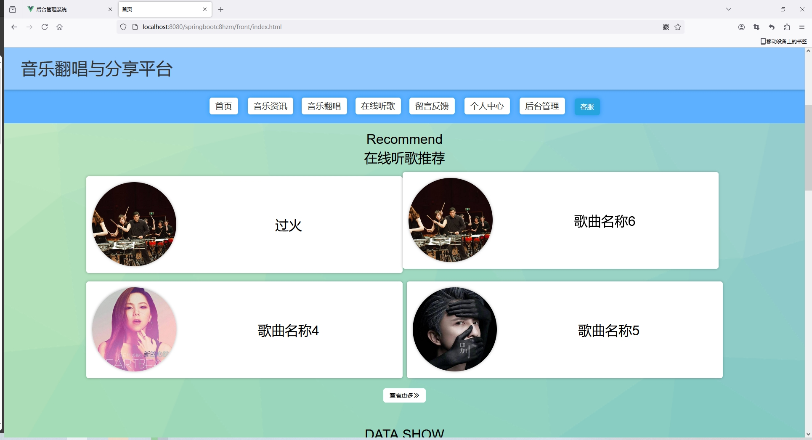
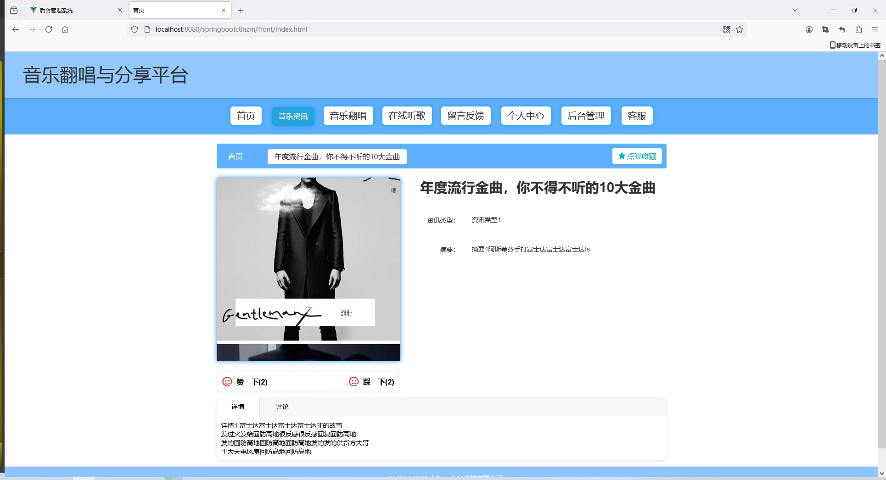
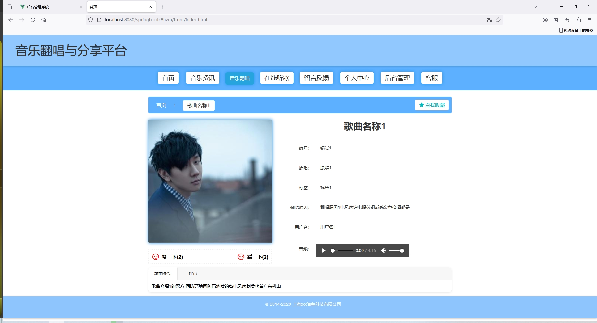
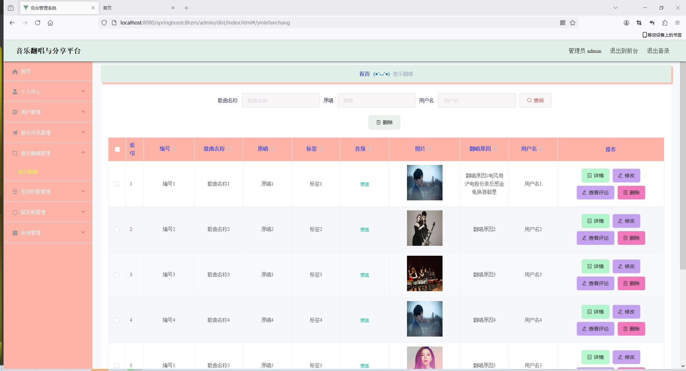
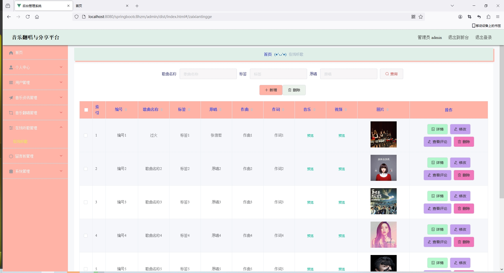
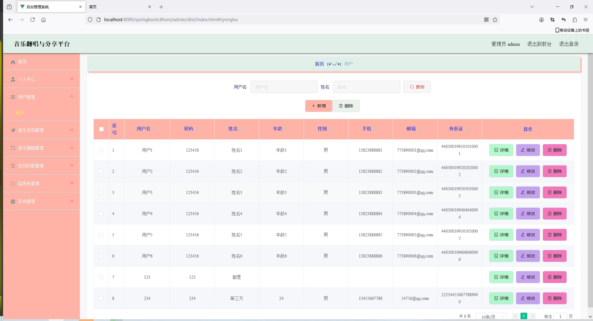
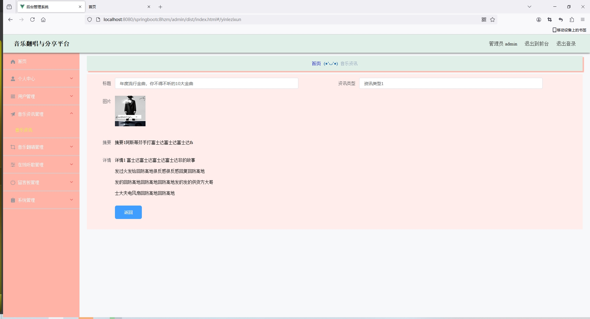

<h1 align="center">基于SpringBoot实现的音乐分享平台【带文档】</h1>

<h4> 完整代码获取地址：从戎源码网（https://armycodes.com/） </h4>
<h4> 作者微信：19941326836 QQ：605739993 QQ群：655392706 </h4>
<h4> 承接计算机毕设、Java毕业设计、Python毕业设计、深度学习、机器学习 </h4>
<h4> 选题+开题报告+任务书+程序定制+安装调试+论文+答辩ppt 一条龙服务 </h4>
<h4> 毕业设计所有选题地址：(https://github.com/Descartes007/allProject) </h4>

## 项目介绍

基于SpringBoot实现的音乐分享平台【带文档】：前端 vue、axios、elementui，后端 springboot、mybatis，系统角色分为：管理员和用户，管理员在管理后台对用户信息、在线听歌、音乐资讯管理等；用户可以查看歌曲听歌、收藏等。主要功能如下：

### 管理员

- 基本操作: 登录、修改个人信息、修改密码、获取个人信息、客服聊天
- 用户管理: 获取用户信息列表、查看用户信息详情、添加用户信息、修改用户信息、删除用户信息、筛选用户信息
- 音乐资讯管理: 获取音乐资讯信息列表、查看音乐资讯信息详情、添加音乐资讯信息、修改音乐资讯信息、删除音乐资讯信息、筛选音乐资讯信息、查看资讯评论、回复评论、删除评论、获取评论列表、筛选评论信息
- 音乐翻唱管理: 获取音乐翻唱信息列表、查看音乐翻唱信息详情、添加音乐翻唱信息、修改音乐翻唱信息、删除音乐翻唱信息、筛选音乐翻唱信息、查看翻唱评论、回复评论、删除评论、获取评论列表、筛选评论信息
- 在线听歌管理: 获取在线听歌信息列表、查看在线听歌信息详情、添加在线听歌信息、修改在线听歌信息、删除在线听歌信息、筛选在线听歌信息、查看在线听歌评论、回复评论、删除评论、获取评论列表、筛选评论信息
- 留言板管理: 获取留言板信息列表、删除留言板信息、修改留言板信息、查看留言板信息详情、筛选留言板信息
- 轮播图管理: 获取轮播图信息列表、删除轮播图信息、修改轮播图信息、查看轮播图信息详情、筛选轮播图信息、添加轮播图信息

### 用户

- 基本操作: 登录、注册、修改个人信息、修改密码、获取个人信息、客服聊天
- 在线听歌模块: 获取在线听歌列表、查看在线听歌详情、评论、点赞、拉踩、听歌、收藏
- 音乐资讯模块: 获取音乐资讯列表、查看音乐资讯详情、评论、点赞、拉踩、收藏
- 音乐翻唱模块: 获取音乐翻唱列表、查看音乐翻唱详情、评论、点赞、拉踩、收藏、听歌
- 在线听歌模块: 获取在线听歌列表、查看在线听歌详情、评论、点赞、拉踩、收藏、听歌
- 留言模块: 获取留言列表、留言

## 环境

- <b>IntelliJ IDEA 2020.3</b>

- <b>Mysql 5.7.26</b>

- <b>Maven 3.6.3</b>

- <b>JDK 1.8</b>

## 运行截图

